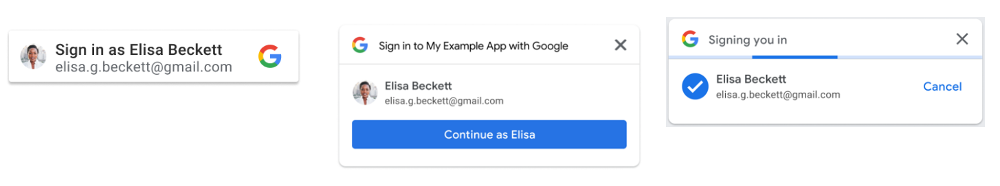

# Google One Tap Sample
Basic Frameworkless sample for Google One Tap User Experience in a web page.

[**Live demo**](https://googleonetap.developer.li/)

# How to use it

To proceed with testing the authentication flow, follow the prompt shown in the top right corner of the page.

The Google One Tap flow is configured to automatically show the prompt in the right top corner, auto-select the current Google Account if you are already logged in with Google and proceed with the authentication flow automatically if you have done it before and your Google account allows it.

If no prompt appears you just can click the button "Sign in with Google" to start the authentication flow.

# Requested scopes

The following info is being requested:

|API|Scope|Description|
|--- |--- |--- |
|-|.../auth/userinfo.email|See your primary Google Account email address|
|-|.../auth/userinfo.profile|See your personal info, including any personal info you've made publicly available|
|-|openid|Associate you with your personal info on Google|

# Important notes

- **The authentication is done in a secure way using HTTPS** and **the data requested to Google by your consent does not leave the browser or saved anywhere.**
- You can inspect the source code or [reach me](mailto:raul@piraces.dev) for more information.
- **This web page is for educational and testing purposes only.**

# License

This project is licensed under the [MIT License](LICENSE).